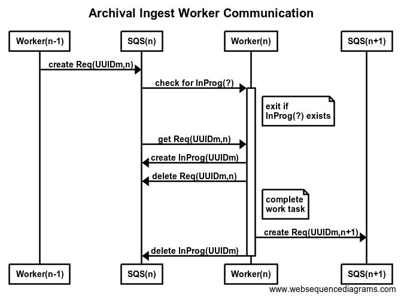

# Archival Storage Ingest

Archival storage ingest is a ruby gem for automating parts of the ingest process.

## Installation

#### Archival storage ingest installation

This guide assumes that rvm is installed under /cul/app/archival_storage_ingest/rvm.

```bash
curl -sSL https://get.rvm.io | bash -s -- --path /cul/app/archival_storage_ingest/rvm
```

If it is installed at a different location, make a symlink to above path.

After cloning from GitHub repository (https://github.com/cul-it/archival-storage-ingest), run the following command.

```ruby
$ bundle install
$ rake install
```

After the gem is installed, you need to set up a configuration YAML file.

It looks for archival_storage_ingest_config environment variable for the configuration file path.
If it is not set, it uses a default value of /cul/app/archival_storage_ingest/conf/queue_ingest.yaml.
Following is an example configuration file.

```fixity_check_sfs.yaml
subscribed_queue: cular_development_fixity_sfs
log_path: /cul/app/archival_storage_ingest/logs/fixity_check_sfs.log
debug: 0
```

#### AWS Configuration

It uses AWS Ruby SDK.
As per the installation guide (https://docs.aws.amazon.com/sdk-for-ruby/v3/developer-guide/setup-install.html),
run the following command.

    $ gem install aws-sdk

After the installation, credentials should be configured.
(https://docs.aws.amazon.com/sdk-for-ruby/v3/developer-guide/setup-config.html).

Either correct environment variables must be set or ~/.aws/credentials file must be created.

If you already have AWS CLI installed, you could run the following command for the configuration.

    $ aws configure

The region must be set to us-east-1.

#### Systemd service setup

For production environments, the gem should be set to run as service.
We may implement a runnable command to handle this part in the future.

Inside the systemd directory of this project, there are conf, scripts and service directory.
- service directory contains systemd service files.
- conf directory contains YAML config files for each of the services.
- scripts directory contains shell scripts used by the systemd service.

As cular user, make symlinks of conf and scripts directory and create log directory.
```bash
$ ln -s PROJECT_DIR/systemd/conf /cul/app/archival_storage_ingest/conf
$ ln -s PROJECT_DIR/systemd/scripts /cul/app/archival_storage_ingest/scripts
$ mkdir /cul/app/archival_storage_ingest/logs
```

Copy service files to a location systemd can recognize.
```bash
$ cp PROJECT_DIR/systemd/service/*.service /etc/systemd/system/
```

Testing
```bash
$ systemctl status fixity_check_sfs
```

Above command should display message similar to the following.
```bash
● fixity_check_sfs.service - Archival Storage Fixity Check SFS Server
   Loaded: loaded (/etc/systemd/system/fixity_check_sfs.service; disabled; vendor preset: disabled)
   Active: inactive (dead)
   ...
```

If you get "Unit fixity_check_sfs could not be found.", check for your OS systemd manual for where to put the service files.

Enabling service
```bash
$ systemctl enable SERVICE
```

On cular-ingest server, you should enable the following services.
- fixity_check_sfs
- fixity_comparison
- ingest
- transfer_s3
- transfer_sfs

On S3 fixity checking VM, enable the following service.
- fixity_check_s3

## Usage

    $ archival_storage_ingest -i [PATH_TO_INGEST_CONFIG_FILE]

-i flag will queue a new ingest as described in the ingest config file.

## Development

For development, you could also create a test gemset via RVM as well with the following command before installation.

    $ rvm gemset create archival_storage_ingest

## Message

```json
{
  "ingest_id": "UUID generated for this ingest",
  "type": "Transfer S3"
}
```

ingest_id is generated when a new ingest is queued by a user and persists through all of the steps for that ingest.

type designates the work that needs to be done upon reception.

Any other information needed for the ingest should be included to this JSON.

## Behavior

* Each service is run as a systemd service and has its own logs.
* Each service works on a dedicated queue.
* Each service will try to poll one message from its designated queue periodically.
* Each service is set to restart on failures. This means that if the service exits normally, systemd won't restart it automatically.
* cular-ingest server uses ingest, transfer s3, transfer sfs, fixity check sfs and fixity compare services.
* AWS fixity checking VM uses fixity check s3 service only.

## Workflow

1. Each service polls for a message from SQS periodically (in progress then work queue).
2. If a message from in progress queue is received, exit normally. *
3. When a service receives a message from the work queue, it logs the contents of the message.
4. The message is put to "in progress" queue of the same work type.
5. The original message is deleted from the work queue.
6. The service completes work task.
7. Send message for next work. E.g. Upon completing transfer s3 task, send new message to fixity check s3 queue with same ingest_id.
8. The message put to in progress queue earlier in this process is deleted.

- If a message is received from in progress queue, it means the service did not complete the job. It will notify admins and exit normally which would make the systemd to not start the service again.
When the problem is resolved, admins should start the service manually.

- Each SQS request would have up to 3 retries. If it still fails after the retries, the service should notify admins and exit normally.

Following diagram describes the work flow.


